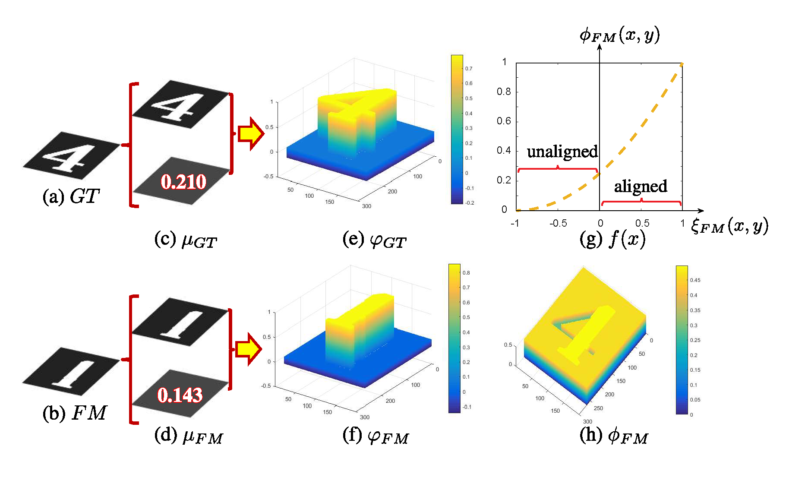
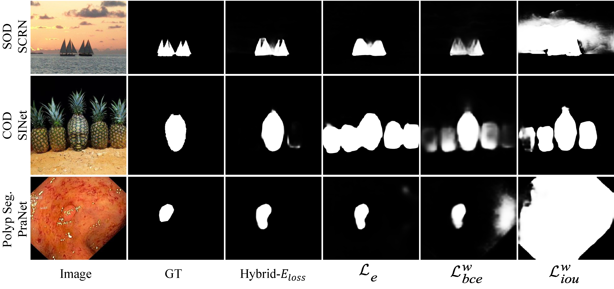

# Hybrid Eloss for object segmentation in PyTorch

The official pytorch implemention of the paper "Cognitive Vision Inspired Object Segmentation Metric and Loss Function"
PDF: http://dpfan.net/wp-content/uploads/Scichina2021_Eloss.pdf

## Introduction

<p align="center">
     <br />
    <em> 
    Figure 1: The pipeline of our $E_\xi$.
  (a) ground-truth （GT）map. (b) the binary foreground map.
  (c) \& (d) are the mean values map of GT \& FM, respectively.
  (e) and (f) are the bias matrices calculated by Eqn.~\ref{equ:bias_matrix}.
  (g) is the mapping function.
  (h) is the enhanced alignment matrix computed by Eqn.~\ref{equ:enhance_alignment_matrix}.
  \emph{``aligned''} \& \emph{``unaligned''} donate those points which
  $GT(x,y) = FM(x,y)$ \& $GT(x,y) \neq FM(x,y)$, respectively.
    </em>
</p>

Object segmentation (OS) technology is a research hotspot in computer vision, and it has a wide range of applications 
in many fields. Cognitive vision studies have shown that human vision is highly sensitive to both global information 
and local details in scenes.
To this end, we design a novel, efficient, and easy-to-use Enhanced-alignment measure ($E_\xi$) for evaluating 
the performance of the OS model.
$E_\xi$ combines local pixel values with the image-level mean value, jointly evaluate the image-/pixel-level similarity 
between a segmentation result and a ground-truth (GT) results.
Extensive experiments on the four popular benchmarks via five meta-measures, i.e., application ranking, demoting generic, 
denying noise, human ranking, and recognizing GT, we observe significant relative improvement compared with existing 
widely-adopted evaluation metrics such as IoU and $F_\beta$.
By using the weighted binary cross-entropy loss, the Enhanced-alignment loss, and the weighted IoU loss, we further 
design a hybrid loss function (Hybrid-$E_{loss}$) to guide the network to learn pixel-, object- and image-level features.
Qualitative and quantitative results show further improvement in terms of accuracy when using our hybrid loss function 
in three different OS tasks.

## Usage

Here, we provide a toy demo of our Hybrid Eloss.

```python
# -*- coding: utf-8 -*-
import torch
from scripts.SINet.lib.SINet import SINet_ResNet50 as model
from Hybrid_Eloss import hybrid_e_loss

# set the hyper-parameters
learning_rate = 1e-6
epoch = 100

# get your prediction map with CUDA mode
img = torch.randn(2, 3, 352, 352).cuda() # bs, c, w, h
pred = torch.randn(2, 1, 352, 352).cuda()
gt = torch.randn(2, 1, 352, 352).cuda()


for i in range(epoch):
    # 1. define forward pass
    pred = model(img)
    # 2. compute loss
    loss = hybrid_e_loss(pred, gt)
    # 3. backprop and update weights
    loss.backward()
```
## Applications

To verify the effectiveness of our Hybrid Eloss, we employ it to existing task in the binary segmentation tasks, including Salient Object detection (SOD), Camouflaged Object Segmentation (COD), and Polyp Segmentation (PSeg).

<p align="center">
     <br />
    <em> 
    Figure 2: Visual comparison of the proposed Hybrid-$E_{loss}$ function via decoupling it, \textit{i.e.}, Hybrid-$E_{loss} = \mathcal{L}^{w}_{ce} + \mathcal{L}^{w}_{iou} + \mathcal{L}_{e}$, we demonstrate the effectiveness of three sub-variants and our $E_{loss}$ on three typical object segmentation tasks, including salient object detection (SOD, \ie, SCRN), camouflaged object detection (COD, \ie, SINet) and polyp segmentation (Polyp Seg., \ie, PraNet).
    </em>
</p>

### Data Preparation

Before the experiments, please download the necessary files from Cowtransfer Drive:

1. Training/Testing dataset used in our paper can be downloaded from this [link](https://gepengji.cowtransfer.com/s/8072c149efae41). Put them into `./data/`.

2. The pre-trained weights generated from corresponding methods with different types of loss functions can be downloaded from this [link](https://gepengji.cowtransfer.com/s/87a0b066630f40). Note that there are three tasks in our extension experiments, and thus, please move three snapshots to the corresponding path: `./scripts/SCRN/snapshots/`, `./scripts/SINet/snapshots/`, and `./scripts/PraNet/snapshots/`, respectively.

3. The prediction map can be downloaded from [link](https://gepengji.cowtransfer.com/s/d27056171c6049). Similar to the last operation, please move three snapshots to the corresponding path: `./scripts/SCRN/res/`, `./scripts/SINet/res/`, and `./scripts/PraNet/res/`, respectively.

### Task-1: Salient Object detection

The model, termed __SCRN__, is borrowed from __Stacked Cross Refinement Network for Edge-Aware Salient Object Detection__. (ICCV-2019, [GitHub](https://github.com/wuzhe71/SCRN), [Paper](http://openaccess.thecvf.com/content_ICCV_2019/papers/Wu_Stacked_Cross_Refinement_Network_for_Edge-Aware_Salient_Object_Detection_ICCV_2019_paper.pdf), [Supplementary Materials](http://openaccess.thecvf.com/content_ICCV_2019/supplemental/Wu_Stacked_Cross_Refinement_ICCV_2019_supplemental.pdf))

- Training
  
  Choose the differnt type of loss function in parser (`--loss_type`).  Change your directory (run `cd ./scripts/SCRN`) and start training (`python training.py`)

- Testing
  
  Change your directory (`cd ./scripts/SCRN`) and start testing (`python inference.py`)

- Evaluation
  
  Change your directory (`cd ./scripts/SCRN/eval`) and run the evaluation code in the Matlab software (`matlab -nodesktop -nojvm -nodisplay -r main.m`).

### Task-2: Camouflaged Object Segmentation

The model, termed **SINet**, is borrowed from **Camouflaged Object Detection** (CVPR-2020, [Github](https://github.com/DengPingFan/SINet), [Paper](https://openaccess.thecvf.com/content_CVPR_2020/papers/Fan_Camouflaged_Object_Detection_CVPR_2020_paper.pdf))

- Training
  
  Choose the differnt type of loss function in parser (`--loss_type`).  Change your directory (run `cd ./scripts/SINet`) and start training (`python training.py`)

- Testing
  
  Change your directory (`cd ./scripts/SINet`) and start testing (`python inference.py`)

- Evaluation
  
  Change your directory (`cd ./scripts/SINet/eval`) and run the evaluation code in the Matlab software (`matlab -nodesktop -nojvm -nodisplay -r main.m`).

### Task-3: Polyp Segmentation

The model, termed __PraNet__, is borrowed from __Parallel Reverse Attention Network for Polyp Segmentation__ (MICCAI-2020, [GitHub](https://github.com/DengPingFan/PraNet), [Paper](https://github.com/DengPingFan/PraNet/blob/master))

- Training
  
  Choose the differnt type of loss function in parser (`--loss_type`).  Change your directory (run `cd ./scripts/PraNet`) and start training (`python training.py`)

- Testing
  
  Change your directory (`cd ./scripts/PraNet`) and start testing (`python inference.py`)

- Evaluation

  Change your directory (`cd ./scripts/PraNet/eval`) and run the evaluation code in the Matlab software (`matlab -nodesktop -nojvm -nodisplay -r main.m`).

## Reference

    @ARTICLE{21Fan_HybridLoss,
        author={范登平 and 季葛鹏 and 秦雪彬 and 程明明},
        journal={中国科学：信息科学}, 
        title={认知视觉启发的物体分割评价标准及损失函数}, 
        year={2021},
        volume={},
        number={},
        pages={},
        doi={10.1360/SSI-2020-0370}
    }

    @article{21Fan_HybridLoss,
      title={Cognitive Vision Inspired Object Segmentation Metric and Loss Function},
      author={Fan, Deng-Ping and Ji, Ge-Peng and Qin, Xuebin and Cheng, Ming-Ming},
      journal={SCIENTIA SINICA Informationis},
      year={2021},
      volume={}, 
      number={},
      doi={10.1360/SSI-2020-0370},
      publisher={Science China Press}
    }
